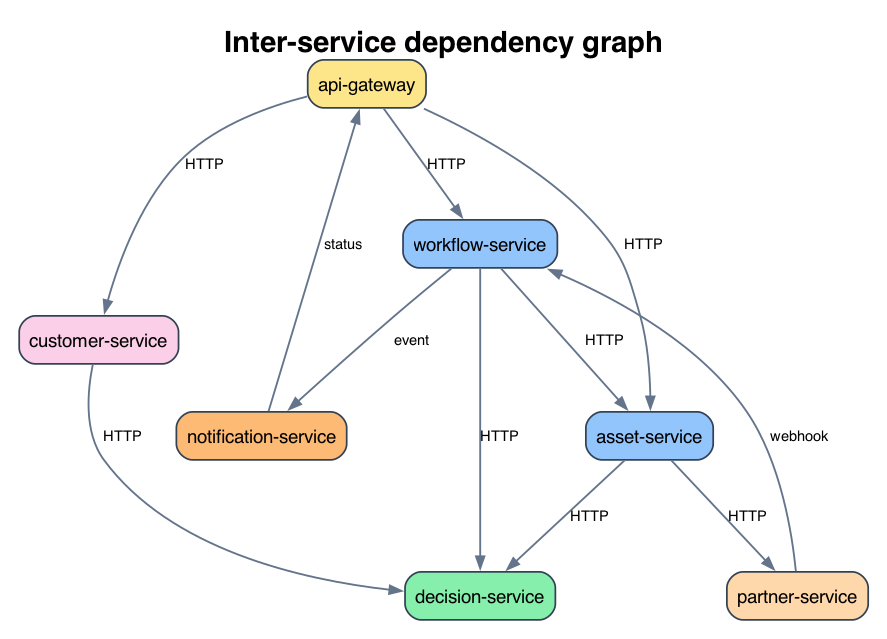
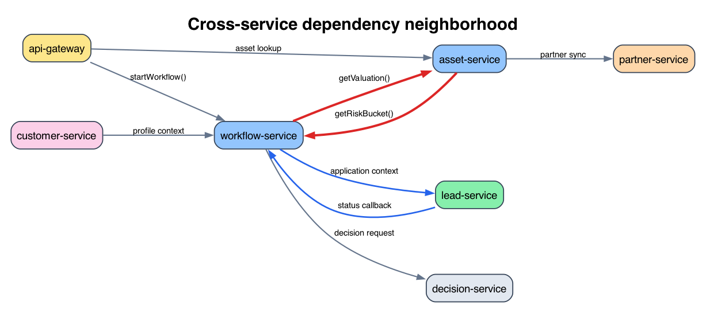
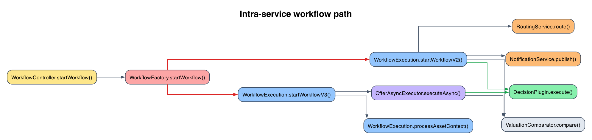
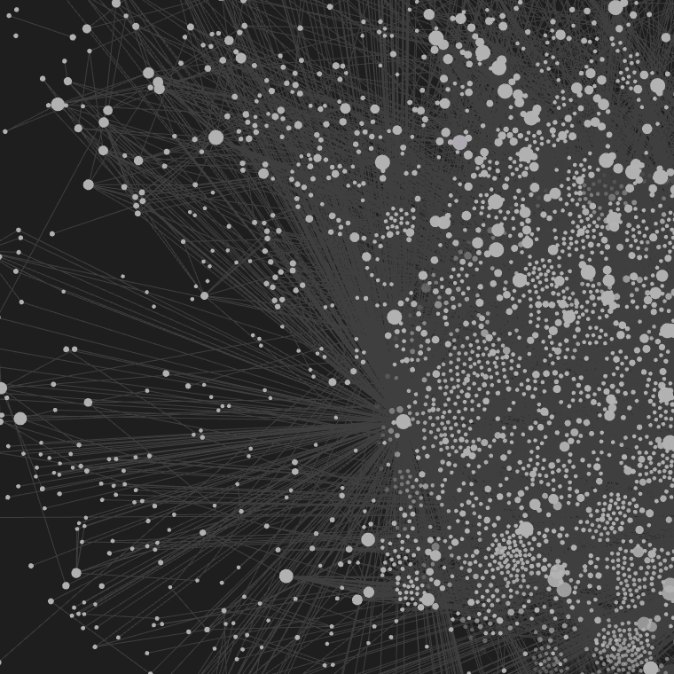
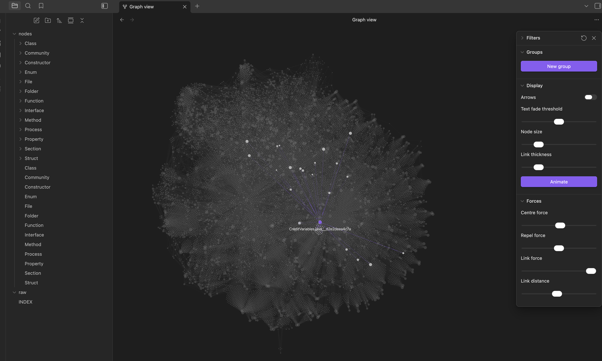

# microservice-kg

[](https://www.npmjs.com/package/microservice-kg)
[](https://github.com/pawarss1/microservice-kg)

`microservice-kg` builds a consolidated knowledge graph for a directory containing many services.

`npm`: [microservice-kg](https://www.npmjs.com/package/microservice-kg)  
`GitHub`: [pawarss1/microservice-kg](https://github.com/pawarss1/microservice-kg)

It is designed for multi-repo microservice workspaces where static code reasoning needs to happen at two levels at once:

- service-to-service dependencies
- class and method evidence behind each dependency

The first version focuses on Java/Spring microservices and produces:

- service inventory
- HTTP provider endpoints
- HTTP client edges via `@FeignClient`
- method-level evidence for each cross-service edge
- in-service class and method interaction edges

## Why this exists

In multi-service codebases, code search alone is not enough. You also need a durable model of:

- which services exist
- which services call which other services
- which class and method create that dependency
- which controller or provider method receives the traffic on the target side

`microservice-kg` adds that architecture layer on top of a multi-repo workspace so you can answer:

- which services call which other services
- which class and method create that dependency
- which controller method receives the traffic on the target side

That becomes valuable when a change crosses service boundaries and a local file-by-file view is no longer sufficient.

## Why this is useful for agentic coding

Public coding agents such as Claude Code and Codex are documented to inspect repositories, read and edit files, run commands, and gain extra context through MCP. Claude Code also documents a `ripgrep` dependency in its setup flow, which reinforces that file and search tooling are part of the normal local reasoning path.

That makes these systems strong at local code understanding, but they do not start with a durable relational model of service-to-service dependencies across a workspace.

That creates a predictable failure mode:

- the agent finds one caller and assumes it is the only caller
- the agent edits one repo without seeing the upstream or downstream service contract
- the agent repeatedly reconstructs architecture from ad-hoc searches and partial code reads
- the agent invents likely service relationships that are not actually present in code

`microservice-kg` reduces that failure mode by turning service dependencies into queryable graph data.

With this graph, an agent can:

- list all logical services in a workspace
- inspect incoming and outgoing dependencies of a service
- inspect the exact edge between two services
- find paths between services
- compute service-level blast radius before changing a contract

## How this helps avoid hallucination

This project does not try to "guess" architecture from naming alone. It anchors graph edges in code evidence:

- Spring controllers and request mappings define provider endpoints
- Feign clients define outbound service calls
- method-level call-site inference identifies which class and method actually trigger a cross-service dependency

That means an agent can answer:

- "Does service A really call service B?"
- "Which method does it call?"
- "Who in the source repo triggers that call?"

with evidence instead of speculation.

This does not eliminate hallucination entirely, but it narrows the space in which an agent has to infer behavior.

## Screenshots

The images below are sanitized examples intended for the public README.

### Inter-service graph



### Cross-service neighborhood



### Intra-service workflow path



### Obsidian graph view



### Obsidian graph detail



## Install

```bash
npm install -g microservice-kg
```

Or run it without a global install:

```bash
npx microservice-kg analyze /path/to/workspace --output ./output
```

## Scoped GitHub Packages distribution

The repository can also publish a scoped package for GitHub Packages:

```bash
@pawarss1/microservice-kg
```

That distribution is intended for GitHub-native package discovery and for populating the repository's `Packages` section. The public npm package remains:

```bash
microservice-kg
```

## Usage

```bash
node src/cli.mjs analyze /path/to/workspace
```

Optional output directory:

```bash
node src/cli.mjs analyze /path/to/workspace --output /path/to/output
```

The analyzer writes:

- `service-graph.json`
- `summary.md`

## Example workflow

Analyze a workspace:

```bash
node src/cli.mjs analyze /Users/me/workspace/services
```

Export a service-level Obsidian vault:

```bash
node src/export-obsidian.mjs /Users/me/workspace/services/.microservice-kg/service-graph.json /Users/me/workspace/services/obsidian-vault
```

## MCP server

The project also exposes the generated graph over MCP so coding agents can query service dependencies while making changes.

Run the server against the default local graph:

```bash
node src/mcp-server.mjs
```

Or point it at a specific graph artifact:

```bash
MICROSERVICE_KG_GRAPH=/path/to/service-graph.json node src/mcp-server.mjs
```

Available MCP tools:

- `analyze_workspace`
- `list_services`
- `service_context`
- `edge_details`
- `dependency_path`
- `service_impact`

For `dependency_path` and `service_impact`, `maxDepth` is optional. If omitted, traversal walks as deep as the currently loaded logical service graph allows.

Example MCP registration:

```bash
codex mcp add microservice-kg -- env MICROSERVICE_KG_GRAPH=/path/to/service-graph.json node /path/to/microservice-kg/src/mcp-server.mjs
```

Example questions an agent can ask through MCP:

- "List all services in this workspace."
- "Show the incoming and outgoing dependencies of a service."
- "Explain the edge between two services with method-level evidence."
- "Find the dependency path from one service to another."
- "Show the downstream impact of changing a service."

## Current scope

- Java/Spring service discovery
- `@RestController` and `@RequestMapping` endpoint extraction
- `@FeignClient` extraction
- config-backed path and URL resolution from `application*.properties|yml|yaml`
- field-based method call inference inside Java classes
- Obsidian export for service-level graph visualization
- MCP server for editor and coding-agent integration

## Current limitations

- HTTP edges currently focus on `@FeignClient`
- `WebClient`, `RestTemplate`, Kafka, gRPC, and async messaging are not fully modeled yet
- service identity normalization is pragmatic, not perfect
- large workspaces may need a future incremental indexer rather than full rescans

## Roadmap

- `WebClient` and `RestTemplate`
- Kafka producers and consumers
- gRPC
- runtime reconciliation with OpenTelemetry service graphs
- graph UI and interactive exploration

## References

- [Claude Code settings](https://code.claude.com/docs/en/settings)
- [Claude Code setup](https://code.claude.com/docs/en/setup)
- [OpenAI Codex CLI](https://developers.openai.com/codex/cli)
- [How OpenAI uses Codex](https://openai.com/business/guides-and-resources/how-openai-uses-codex/)
