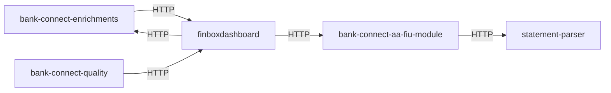

# Microservice KG Summary

- Generated at: 2026-04-23T09:05:25.617Z
- Input directory: /Users/fbin-blr-0107/finboxProjects
- Language: python
- Services discovered: 5
- Service edges discovered: 5
- Queue channels: 0

## Service Graph

## Services

### bank-connect-aa-fiu-module
- Root: bank-connect-aa-fiu-module
- Endpoints: 17
- Clients: 21
- Method interactions: 0
- Outgoing services: statement-parser

### bank-connect-enrichments
- Root: bank-connect-enrichments
- Endpoints: 8
- Clients: 9
- Method interactions: 0
- Outgoing services: finboxdashboard

### bank-connect-quality
- Root: bank-connect-quality
- Endpoints: 138
- Clients: 25
- Method interactions: 0
- Outgoing services: finboxdashboard

### finboxdashboard
- Root: finboxdashboard
- Endpoints: 181
- Clients: 87
- Method interactions: 0
- Outgoing services: bank-connect-aa-fiu-module, bank-connect-enrichments

### statement-parser
- Root: statement-parser
- Endpoints: 9
- Clients: 2
- Method interactions: 0

## Edge Evidence

### bank-connect-aa-fiu-module -> statement-parser
- GET /external/parser

### bank-connect-enrichments -> finboxdashboard
- GET /v1/access/cache_data
- GET /v1/access/cache_data

### bank-connect-quality -> finboxdashboard
- GET /bank-connect/v1/entity/{}/xlsx_report
- POST /bank-connect/v1/internal/create_or_update_fsmlib_general_data

### finboxdashboard -> bank-connect-aa-fiu-module
- GET /v1/access/data
- GET /v1/access/cc_data

### finboxdashboard -> bank-connect-enrichments
- GET /enrichments/predictors
- Provider: null.null
- GET /enrichments/entity_predictor
- Provider: null.null
- GET /enrichments/monthly_analysis
- Provider: null.null
- GET /enrichments/eod_balance
- Provider: null.null
- GET /enrichments/income
- Provider: null.null

